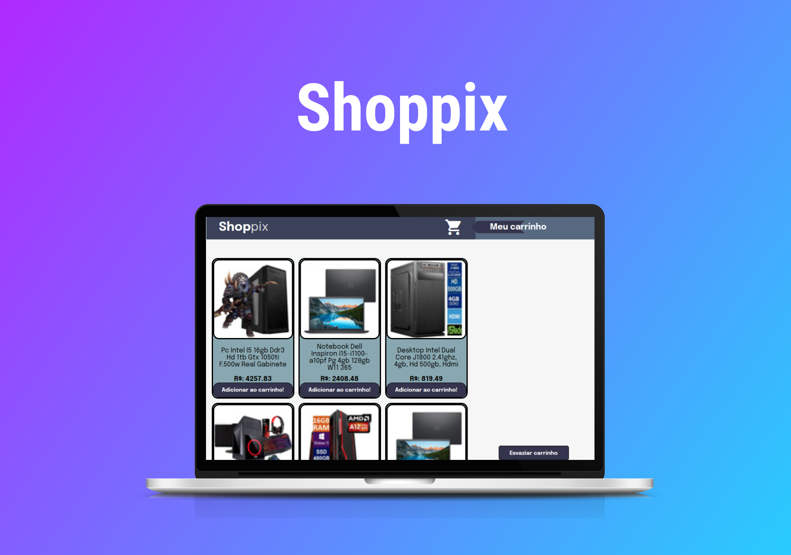

<h1 align="center"> Shopping Cart </h1>

Carrinho de compras dinâmico utilizando API.  

  <a href="#-tecnologias">Tecnologias</a>&nbsp;&nbsp;&nbsp;|&nbsp;&nbsp;&nbsp;
  <a href="#-projeto">Projeto</a>

 

<!-- ⚠️ Projeto passando por algumas alterações de CSS, em breve disponibilizo as mudanças. ⚠️ -->

  

## 🚀 Tecnologias

Esse projeto foi desenvolvido com as seguintes tecnologias:

- HTML e CSS
- JavaScript
- Git e Github
- Requisição a API
- testes unitários

## 💻 Projeto

O Shopping Cart é um carrinho dinâmico que utila a API do Mercado Livre. Feito com HTML, CSS e JavaScript.

<h2 align="center">Feito com ♥ by ogabrielfef</h2>